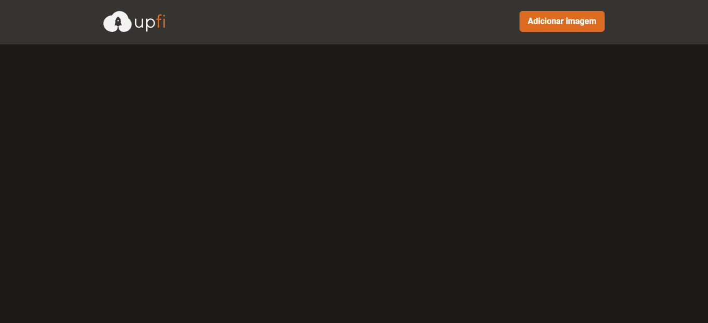

<section align="center">
    
</section>

---

<h2 align="center">Summary</h2>

    <a href="#description">📙 Description</a>
    <a href="#preview">🖼️ Preview</a>
    <a href="#technologies">💻 Technologies</a>

<H2 id="about">📙 Description</H2>

An app that allow the user to upload and list images using React Query, React Hook Form and Chakra UI.

The challenge is to implement pontual changes on specific components to develop the application features, using the tools studied on the last two chapters (React Query and React Hook Form).

Originally created on Ignite from <a href="https://www.rocketseat.com.br/">Rocketseat</a> and made by <a href="https://www.linkedin.com/in/kleverson-kenji-iwatani/">Kenji Iwatani</a>

    <h3><a href="https://www.notion.so/Desafio-02-Upload-de-imagens-4cf1c3b1c1ad4a66961b6e48558cc3b8">Challenge description &rarr;</a></h3>

---

<H2 id="preview">🖼️ Preview</H2>

<section align="center">
    
</section>

---

<H2 id="technologies">💻 Technologies</H2>

- [x] <a href="https://nextjs.org/">NextJS</a>
- [x] <a href="https://reactjs.org/">React</a>
- [x] <a href="https://www.typescriptlang.org/">Typescript</a>
- [x] <a href="https://chakra-ui.com/">Chakra UI</a>
- [x] <a href="https://sass-lang.com/">SASS</a>
- [x] <a href="https://fauna.com/">Fauna</a>
- [x] <a href="https://axios-http.com/docs/intro">Axios</a>
- [x] <a href="https://react-query.tanstack.com/">React Query</a>
- [x] <a href="https://react-hook-form.com/">React Hook Form</a>
